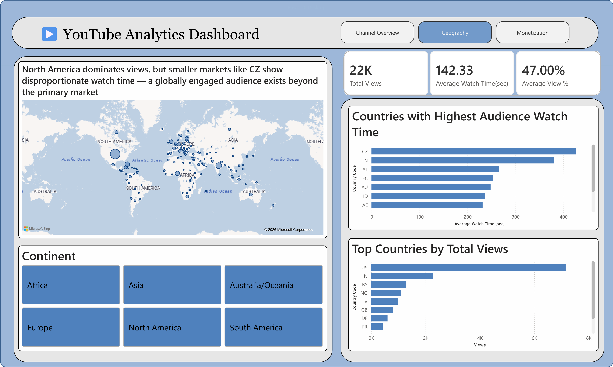

# 📊 YouTube Analytics Dashboard
### An end-to-end data analytics project — from raw data to business insights

**Built by:** Ch.Hinduja Reddy  
**Tools:** MySQL · Excel · Power BI  
**Dataset:** [Ken Jee YouTube Analytics — Kaggle](https://www.kaggle.com/)

---



---

## 🔍 What This Project Is About

YouTube Studio gives creators basic metrics — views, watch time, revenue. But it doesn't tell you *why* certain videos grow the channel, *which* content categories actually earn the most per view, or *where* your most engaged audience really comes from.

This project digs into those questions across a real creator's channel data — building a 2-page interactive Power BI dashboard that goes beyond surface-level stats.

---

## ❓ Questions I Set Out to Answer

- Which video categories drive the most subscriber conversions?
- Do longer videos actually perform better, or just feel like they should?
- Which months were truly the best — and why?
- Where in the world is the audience most engaged vs just clicking?
- Which content categories earn the most revenue per view?
- What does CTR quality distribution look like across the channel?

---

## 🛠️ Project Workflow

```
Raw Kaggle Data → Excel Cleaning → MySQL Analysis → Power BI Dashboard
```

### 1. Excel Cleaning
- Removed duplicates and null values
- Standardized date formats
- Documented all cleaning steps per table

### 2. SQL Analysis
- Built a keyword-based video categorization system using CASE-WHEN logic on video titles — classifying 223 videos into 11 content categories
- Created custom metrics: Growth Rate and Impact Score
- Wrote analytical queries for subscriber conversion, revenue, geo audience and monetization

### 3. Power BI Dashboard
- 3 page interactive dashboard with continent and category slicers
- Tooltips on map bubbles with watch time, view %, and subscribers added
- Insight subtitles on every chart — not just visuals, but conclusions

---

## 📐 Custom Metrics

**Growth Rate**
```sql
0.7 * ((likes_added + comments_added) * 100.0 / views) +
0.3 * ((subscriptions_added * 100.0) / views)
```

**Impact Score**
```sql
(0.7 * ((likes_added + comments_added) * 100.0 / views) +
0.3 * ((subscriptions_added * 100.0) / views))
* LOG(SUM(subscriptions_added) + 1)
```

---

## 💡 Key Findings

- **Learning/Advice and Career/Jobs** content dominates subscriber conversion — these are the categories that actually grow a channel
- **Medium videos** get the highest daily views, but **long videos** build deeper engagement through watch time — both matter
- **CZ leads in watch time** despite the US dominating total views — a highly engaged niche audience exists beyond the primary market
- **"How I Would Learn" format** appears 5 times in the top 10 revenue videos — actionable roadmap content monetizes best
- **Only 12% of videos achieve high CTR** — thumbnail and title optimization is the single biggest untapped opportunity

---

## 📁 Repository Structure

```
youtube-analytics-project/
│
├── README.md
│
├── data/                          # Raw and cleaned datasets
│
├── excel-cleaning/                # Cleaning documentation + before/after screenshots
│   ├── before_after_screenshots/
│   └── cleaning_steps/
│
├── sql/                           # All analytical queries
│
├── powerbi/                       # .pbix file + dashboard screenshots
│   └── dashboard_screenshots/
│
├── insights/
│   └── findings.md
│
└── assets/
    └── dashboard_preview.png
```

---

## 📸 Dashboard Pages

### Page 1 — Channel Performance
Subscriber conversion analysis, content length vs engagement, video category breakdown, and a "YouTube Wrapped" style best performance months table.

### Page 2 — Geography
Global audience map with continent slicer, watch time vs views by country.
### Page 3 — Monetization
CPM vs RPM scatter by content category, CTR quality breakdown, and top revenue videos.

---

*Built independently as a portfolio project. Open to feedback and collaboration.*
